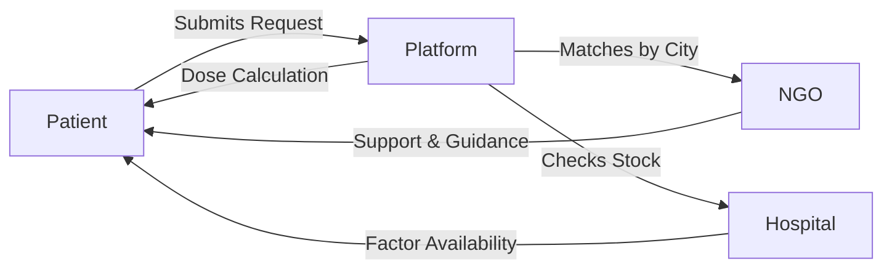

Hemophilia Care Connect

Connecting Patients, NGOs & Hospitals — Faster. Smarter. Together.

---------------------------------------------------

What Is This?

Hemophilia Care Connect is India's first all-in-one digital platform designed to bridge the critical gap between Patients, NGOs, and Hospitals on a single connected network.

Timely access to Factor therapy can save lives — but patients often face critical delays due to fragmented information. This platform exists to eliminate that delay.

------------------

Problem Statements

Patients don't know which hospital has Factor VIII or IX — we solve this with real-time hospital inventory and city-level search.

There's no way to find active NGOs by city — we provide a verified NGO directory with direct messaging.

Patients cannot check if required vials are available — we show live stock status updated directly by hospitals.

There's no tool to calculate the correct dosage — we built a smart dose calculator for any bleed severity.

Patients feel alone during emergencies — our unified request system connects all stakeholders instantly.

-----------

Key Features

Hospital Factor Availability
Real-time stock of Factor VIII, Factor IX, DDAVP, and more. Search hospitals by city or region and see instant availability status.

Connect with NGOs
Browse verified NGOs near your city, send direct messages for support, and receive quick guidance from NGO volunteers.

Smart Factor Dose Calculator
Enter your weight in kg, hemophilia type (A or B), factor type (VIII or IX), and bleeding situation (minor, moderate, or major). The calculator returns the required IU dosage, number of vials needed, and recommended vial sizes of 250, 500, or 1000 IU.

Patient Assistance and Emergency Support
Share your situation directly with hospitals and NGOs. Get guidance, availability info, and support in minutes.

NGO Registration and Dashboard
One-click NGO registration. Manage city-wise coverage and receive and respond to patient requests instantly.

------------

How It Works



---

Tech Stack

Backend: Java 17, Spring Boot
Database: MongoDB
Authentication: JWT, OAuth2
DevOps: Docker

---------------

Getting Started

Prerequisites: Java 17, Spring Boot, MongoDB, Docker and Docker Compose.

```bash
git clone https://github.com/Manas-Rastogi/hemophilia-care-connect.git
cd hemophilia-care-connect
docker-compose up --build
```

----------

User Roles

Patient — Search hospitals, contact NGOs, use dose calculator.
NGO — Register, manage coverage, respond to patient requests.
Hospital — Update factor stock, respond to queries.
Admin — Full platform management.

---

Our Vision

Every Hemophilia patient receives factor therapy on time. No child or patient waits for treatment. Hospitals and NGOs work together through a connected digital ecosystem.

This platform is more than a tool — it is a lifeline, a community, a support system.

---

Contributing

Contributions are welcome.

```bash
git checkout -b feature/YourFeature
git commit -m 'Add YourFeature'
git push origin feature/YourFeature
```

Then open a Pull Request.

---

Author

Developed by Manas
Role: Java Developer
Tech Focus: Spring Boot Docker, MongoDB, GitHub Actions CI/CD

---

Support

If this project matters to you, give it a star and share it.

Together, we can use technology to make healthcare more accessible — one patient at a time.
