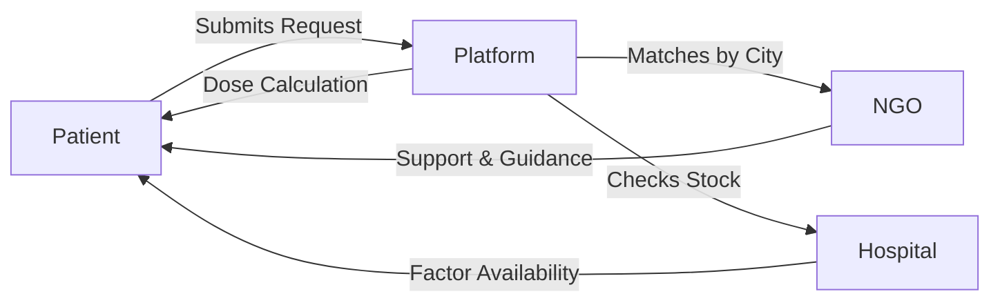

# 🌟 Hemophilia Care Connect

> **Connecting Patients, NGOs & Hospitals — Faster. Smarter. Together.**
---------------------


---------------------------------------------------

## 🩸 What Is This?

**Hemophilia Care Connect** is India's first all-in-one digital platform designed to bridge the critical gap between Patients, NGOs, and Hospitals on a single connected network.

Timely access to Factor therapy can save lives — but patients often face critical delays due to fragmented information. This platform exists to eliminate that delay.

---------------------------------------------------

## 🚨 Problem Statement

| ❌ The Gap | ✅ Our Solution |
|---|---|
| Patients don't know which hospital has Factor VIII or IX | Real-time hospital inventory with city-level search |
| No way to find active NGOs by city | Verified NGO directory with direct messaging |
| Cannot check if required vials are available | Live stock status updated by hospitals |
| No tool to calculate correct dosage | Smart dose calculator for any bleed severity |
| Patients feel alone during emergencies | Unified request system connecting all stakeholders |

---------------------------------------------------

## 🔗 Key Features

### 🏥 Hospital Factor Availability
- Real-time stock of **Factor VIII**, **Factor IX**, **DDAVP**, and more
- Search hospitals by city or region
- Instant availability status

### 🤝 Connect with NGOs
- Browse verified NGOs near your city
- Send direct messages for support
- Receive quick guidance from NGO volunteers

### 🧮 Smart Factor Dose Calculator

| Input | Options |
|---|---|
| Weight | In kg |
| Hemophilia Type | A / B |
| Factor Type | VIII / IX |
| Bleeding Situation | Minor / Moderate / Major |

**Output:**
- Required IU dosage
- Number of vials needed
- Recommended vial sizes (250 / 500 / 1000 IU)

### 💬 Patient Assistance & Emergency Support
- Share your situation directly with hospitals and NGOs
- Get guidance, availability info, and support in minutes

### 📝 NGO Registration & Dashboard
- One-click NGO registration
- Manage city-wise coverage
- Receive and respond to patient requests instantly

---------------------------------------------------

## 🗺️ How It Works



---------------------------------------------------

## 🛠️ Tech Stack

| Layer | Technology |
|---|---|
| Frontend | React.js / HTML5 / CSS3 |
| Backend | Java 17, Spring Boot |
| Database | MongoDB |
| Authentication | JWT / OAuth2 |
| Notifications | RabbitMQ / Firebase |
| DevOps | Docker, GitHub Actions |

---

## 🚀 Getting Started

### Prerequisites

- Java 17
- Node.js
- MongoDB
- Docker & Docker Compose

### Run Locally

```bash
# Clone the repository
git clone https://github.com/your-username/hemophilia-care-connect.git

# Navigate to the project directory
cd hemophilia-care-connect

# Start all services
docker-compose up --build
```

---------------------------------------------------

## 👥 User Roles

| Role | Access |
|---|---|
| **Patient** | Search hospitals, contact NGOs, use dose calculator |
| **NGO** | Register, manage coverage, respond to patient requests |
| **Hospital** | Update factor stock, respond to queries |
| **Admin** | Full platform management |

---

## 🌍 Our Vision

We dream of a future where:

- ✅ Every Hemophilia patient receives factor therapy on time
- ✅ No child or patient waits for treatment
- ✅ Hospitals and NGOs work together through a connected digital ecosystem

> This platform is more than a tool — it is a **lifeline**, a **community**, a **support system**.

---------------------------------------------------

## 🤝 Contributing

Contributions are welcome!

1. Fork the repository
2. Create your feature branch: `git checkout -b feature/YourFeature`
3. Commit your changes: `git commit -m 'Add YourFeature'`
4. Push to the branch: `git push origin feature/YourFeature`
5. Open a Pull Request

---------------------------------------------------

## 👨‍💻 Author

**Developed by: Manas**
Role: Java Developer
Tech Focus: `Spring Boot` • `React` • `Docker` • `MongoDB` • `GitHub Actions CI/CD`

---------------------------------------------------

## ⭐ Support

If this project matters to you, please **give it a star** ⭐ and share it.

> Together, we can use technology to make healthcare more accessible — one patient at a time. ❤️
